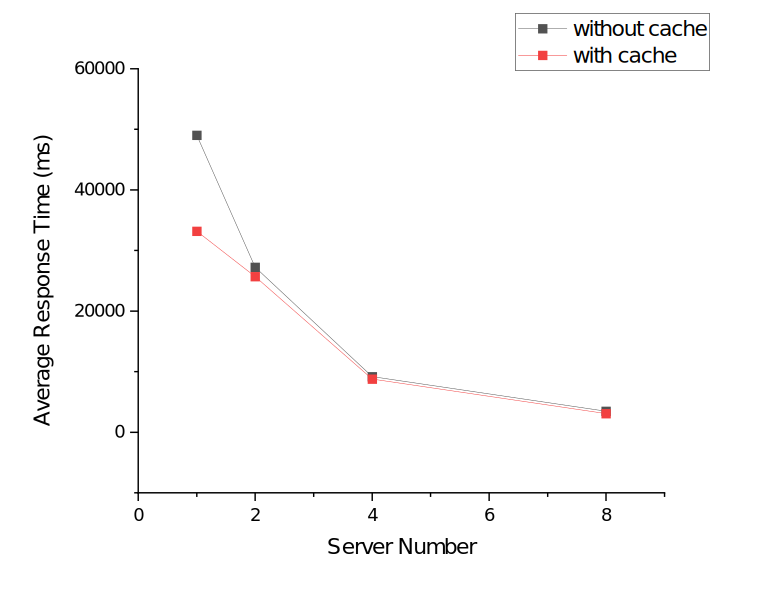

# 实验报告

## 实验环境

- Ubuntu 20.04.2 LTS (WSL 2)
- Docker 20.10.5 (WSL2)
- HA-Proxy 2.3.9
- Redis 6.2.1 (Docker)
- Gatling 3.5.1

## 实验过程

本次实验在上次实验基础上完成，大致步骤如下：

1. 在上次实验代码基础上新增`StudentService`类，接入Redis缓存；
2. 使用Jib插件将应用封装入Dockers镜像；
3. 使用Gatling进行压力测试。

值得一提的是，本次实验中，我们仍选择H2作为数据库，而不是用一个单独的MySQL数据库作为共享存储。这是基于如下考虑：

1. 本次实验中测试的查询并不会修改数据，因此无需进行数据同步；
2. 最重要地，使用一个单独的MySQL数据库作为共享存储，会导致数据服务器成为整个系统的性能瓶颈，而本实验中，我们使用HA-Proxy进行水平扩展的是Controller层，而不扩展数据服务器，因此，若使用MySQL则实验中无法衡量出水平扩展后系统与原系统的性能差距。

为了进行测试，我们随机生成了一万条学生数据，预先装入数据库中，并在`StudentRepository`中新增一条较为复杂的查询：

```SQl
SELECT student FROM Student student WHERE student.nativePlace LIKE '湖北省' OR student.department LIKE '计算机科学与技术系' ORDER BY student.birthDate ASC, student.ID ASC
```

作为测试语句。

随后，我们使用Gatling模拟100名用户使用管理系统进行这一查询时的性能情况。

## 实验结果

我们获得的实验结果如下（时间单位：ms）：

| 服务器数量 | 是否使用Cache | 平均响应时间 |
| ---------- | ------------- | ------------ |
| 1          | 否            | 49044        |
| 1          | 是            | 33200        |
| 2          | 否            | 27252        |
| 2          | 是            | 25684        |
| 4          | 否            | 9162         |
| 4          | 是            | 8760         |
| 8          | 否            | 3475         |
| 8          | 是            | 3082         |

折线图如下：



## 讨论

基于实验结果，我们有以下分析：

1. 在Cache配置相同（即都使用或都不使用）的情况下，增加服务器节点数量能够提高系统性能，减少响应时间，且响应时间与服务器节点数量大体成反比——具体而言，在不使用Cache时，服务器数量每增加到原来的2倍，平均响应时间平均下降57.6%；在不使用Cache时，服务器数量每增加到原来的2倍，平均响应时间平均下降51.1%。
2. 在服务器节点数量相同的情况下，使用Cache能够提高系统性能，减少响应时间，在服务器节点数量为1、2、4、8的情况下，使用Cache分别能够使平均响应时间减少32.3%、5.8%、4.4%、11.3%。
3. 使用Cache对性能的提升不如增加服务器数量显著，这可能有以下两点原因：
   1. “使用Cache”这一因素与服务器增加数量没有统一的衡量标准，例如，如果将“使用Cache”与服务器增加到原来的1.1倍比，可能后者对性能提升的作用就会不如前者大；
   2. 本次实验中，性能测试测试的是用户并发访问网站时的情况，因此，影响性能的主要是同一时间能够提供服务的接口数量（即服务器节点数量）而非之前访问时是否有留下Cache，后者可能在串行使用服务的情况下对性能影响较大。
4. 另外，如前文所述，在本次实验中我们仍选择让每个服务器分别拥有单独的H2数据库，而不使用一个单独的MySQL数据库作为共享存储，我们猜测，如果使用共享存储的方案，本实验中水平扩展方案对性能的提升可能就不会那么明显，因为此时数据服务器成为性能瓶颈，在此情况下，必须要同时扩展数据服务器。

## 其他

- 本次实验中使用的HA-Proxy配置见`misc/haproxy.config`；
- 本次实验的压力测试结果见`misc/test_results`，其下文件夹命名形如`<number>[cn]`，其中，数字表示服务器数量，`c` 表示带Cache，`n`表示不带Cache。
